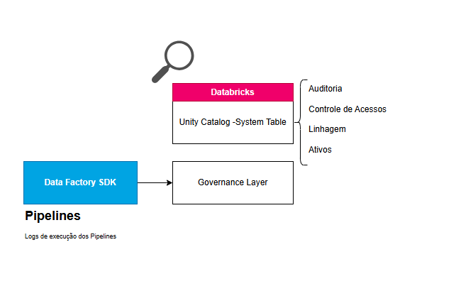
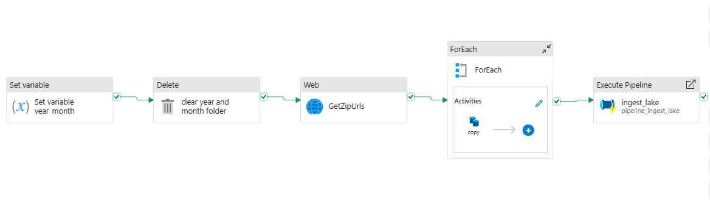
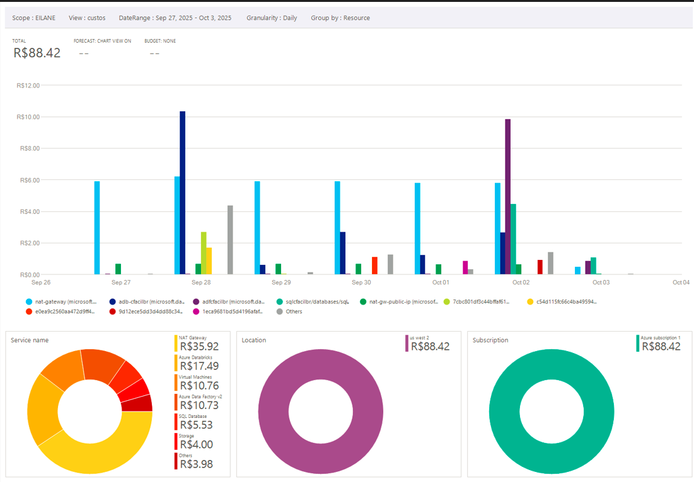

# Integração de Dados Clientes PJ

## Sumário

1. [Objetivo](#objetivo)
2. [Caso de Uso](#caso-de-uso)
3. [Arquitetura](#arquitetura-da-solução)
4. [Monitoramento e Observabilidade](#monitoramento-e-observabilidade)  
5. [Funções e Pipelines de Dados](#Pipelines-de-dados)
6. [Resiliência dos Pipelines de Dados](#Resiliência-dos-pipelines-de-dados)
7. [Tabelas](#cadastro-de-tabelas-e-modelagem-de-dados)  
8. [Qualidade de Dados](#motor-de-qualidade-de-dados)  
9. [Expurgo de Dados](#expurgo-de-dados)  
10. [Plano de Recuperação e Local de Armazenamento](#plano-de-recuperação-e-local-de-armazenamento)  
11. [Visualização de Dados](#visualização-de-dados)
12. [Solução Técnica](#solução-técnica)
13. [Análise das Tecnologias Escolhidas](#análise-de-mercado-e-tecnologias-escolhidas)  
14. [Referências](#referências)
---

## 1. Objetivo

O projeto tem como objetivo simular e implementar um caso de uso concreto, abordando os principais conceitos e fundamentos essenciais de uma plataforma de dados moderna.  
A solução será focada na disponibilização de dados com **alta qualidade**, **segurança**, **monitoramento eficiente** e **escalabilidade**, assegurando uma gestão de dados **robusta, confiável e sustentável**.


## 2. Caso de Uso

**Empresa:** CrediFácil Brasil *(fictícia)*  
**Projeto:** Integração dados públicos - Fase 1 Empresas  
**Caso de Uso:** Integração de Dados Clientes PJ  

### **2.0.1 - Descrição**
Coletar, analisar e disponibilizar dados cadastrais de clientes PJ e dados públicos de empresas com uma base da receita federal, com foco em qualidade, governança e integração ao ecossistema analítico corporativo.

### **2.0.2 - Escopo do Caso de Uso**

- **Obtenção de dados fictícios de clientes (PJ):**  
  Simular a ingestão de cadastros de clientes pessoa jurídica pertencentes a uma empresa fictícia do setor de empréstimos.

- **Integração com dados públicos de empresas (CNPJ):**  
  Realizar a extração de dados públicos junto ao Ministério da Fazenda.

- **Armazenamento no Data Lake corporativo:**  
  Persistir todos os dados obtidos no Data Lake.

- **Verificação da situação cadastral da empresa:**  
  Validar se a empresa encontra-se em situação ativa, inativa, inapta ou baixada.

- **Análise de possíveis irregularidades:**  
  Identificar possíveis inconsistências ou comportamentos suspeitos nos dados de CNPJ.


- **Análise de potenciais clientes:**  
  Analisar potenciais clientes para promover campanhas de crédito


### **2.0.3 - Diagrama do Caso de Uso**


### 2.0.4 - Riscos Operacionais Mapeados na utilização de Dados Públicos

### Matriz de Riscos Mapeados

| **Risco** | **Impacto Potencial** | **Estratégia de Mitigação** |
|-----------|------------------------|-----------------------------|
| Alteração no layout da página ou modificações na estrutura dos datasets sem comunicação prévia | Interrupção na extração automática dos dados, ocasionando falhas no pipeline | Utilizar os dados apenas para fins analíticos, reduzindo o impacto de interrupções temporárias para o cliente final nos sistemas transacionais |
| Presença de dados duplicados nos arquivos disponibilizados | Aumento no volume de armazenamento e risco de análises incorretas | Aplicar deduplicação no processamento e gerar relatórios de controle para acompanhamento contínuo |


### 2.0.5 Premissas

- Atualização dos **dados de clientes** do sistema de crédito no Data Lake.  
- Latência máxima de **15 minutos** para refletir as alterações.  
- Objetivo: **evitar o envio de campanhas de crédito** para clientes já cadastrados na base de dados.


## 3. Arquitetura

### 3.0.1 Desenho de Arquitetura
Para viabilizar o caso de uso descrito no item 2, os dados serão extraídos diretamente de suas fontes de origem e integrados a uma arquitetura de dados Lakehouse na nuvem pública Microsoft Azure.


### 3.0.2 - Estrutura lógica das camadas do Data Lake

Os dados estão organizados no Data Lake conforme o padrão de design da arquitetura Medallion, que estrutura a informação em camadas lógicas (Bronze, Silver e Gold), foi adicionado a camada adicional "raw" que mantém os dados em seu formato original (csv,parquet,json). 

As informações de auditoria, monitoramento e qualidade foram separadas dos dados de negócio e serão armazenadas na camada Governance, garantindo maior organização e controle sobre os metadados e processos de governança.


### 3.0.3 – Integração dos Recursos com o Data Lake Gen2

Recursos com acesso direto ao Data Lake Corporativo


### 3.0.4 – Estrutura do Terraform

Este repositório organiza a infraestrutura como código (IaC) utilizando **Terraform**, com módulos separados por serviço para facilitar manutenção e reutilização.

```bash
terraform
├── main.tf              # Arquivo principal com recursos globais e providers
├── variables.tf         # Declaração de variáveis
├── terraform.tfvars     # Valores sensíveis | Não está no git
├── provider.tf          # Configuração do provider
├── modules
│   ├── resource_group
│   │   # Módulo cria o Resource Group principal do projeto
│   │  
│   ├── azure_sql        # Módulo cria o SQL DATABASE
│   │   └── scripts      # Scripts SQL, como init_credito.sql para tabelas e CDC
│   │
│   ├── databricks
│   │   # Módulo cria os recursos abaixo:
│   │   # - workspace
│   │   # - managed_identity
│   │   # - metastore
│   │   # - storage_credential
│   │   # - external_locations
│   │   # - catalog
│   │   # - schemas
│   │   # - notebooks (bronze, silver, gold, governance)
│   │   # - cluster
│   │   # - jobs
│   │   # - roles
│   │
│   ├── data_factory
│   │   # Módulo cria:
│   │   # - linked_services
│   │   # - datasets
│   │   # - pipelines
│   │   # - triggers
│   │   # - roles
│   │
│   ├── functions_app
│   │   # Módulo cria função Python
│   │
│   ├── keyvault
│   │   # Módulo cria Key Vault e secrets
│   │   # - senha_db
│   │   # - role 
│   │
│   └── storage_account
│       # Módulo cria os containers:
│       # - raw
│       # - bronze
│       # - silver
│       # - gold
│       # - governance
│       # - Politicas 

```

### 3.0.4 – Premissas e Políticas

- O **Data Factory** será a principal fonte de comunicação com dados externos, garantindo integração controlada e monitorada.

- O acesso aos recursos no **Data Lake** será restrito ao **Unity Catalog** e ao **Data Factory**, utilizando **Managed Identity** para autenticação segura.

- As aplicações, **com exceção dos recursos mencionados acima**, não poderão acessar diretamente o Data Lake corporativo, garantindo isolamento e segurança dos dados.

- Para **redução de custos**, os dados da camada **raw** terão um **lifecycle de 6 meses**; após esse período, serão expurgados automaticamente.

- Os dados das demais camadas serão movidos para uma **camada cold storage** após **5 anos**, permitindo retenção de longo prazo com custo reduzido.

## 4. Monitoramento, Auditoria e Controle de Ativos


## 5. Funções e Pipelines de Dados

### **5.0.1 - Azure Function** – `funcaoreceita`

**Descrição:** Função responsável por extrair todas as URLs válidas dos arquivos disponíveis para download, a partir do HTML do site:  
`https://arquivos.receitafederal.gov.br/dados/cnpj/dados_abertos_cnpj/{year_month}/`,  
**Entrada:**  
- `year_month` (formato `YYYY-MM`)  
**Saída:**  
- JSON contendo uma lista de URLs válidas para download dos arquivos.


### **5.0.2 - Pipeline de Dados** – `pipeline_ingest_dados_pj`
**Descrição:** Pipeline responsável por capturar e armazenar dados públicos de empresas no Data Lake.  
**Periodicidade:** Mensal  
**Dia:** Último dia do mês  
**Horário:** 09:00  



### 5.0.3 - Pipeline: `pipeline_ingest_lake`
**Descrição:** Pipeline responsável por atualizar as tabelas bronze, silvers, gold no Data Lake.  


## 6. Resiliência dos Pipelines de Dados

### 6.0.1 - Pipeline: `pipeline_ingest_dados_pj`

**Reprocessamento:**  
O pipeline permite informar o ano e mês a serem reprocessados no formato `YYYY-MM`.  
Caso nenhum valor seja fornecido, o pipeline utiliza automaticamente o ano e mês atuais.

**Configuração de retomada (Retry):**  
- Até 3 tentativas em caso de falha  
- Intervalo de 60 segundos entre cada tentativa


## 7. Tabelas

###  7.0.1 - SCD - Slowly Changing Dimensions  

Técnica de gerenciamento de dados que define como as tabelas lidam com informações que mudam ao longo do tempo.  

#### Aplicado Tipo 0 nas Tabelas *Bronze* 
  - Sem alterações, apenas append
#### Aplicado Tipo 1 nas Tabelas *Silver* e *Gold*  

- **Tipo 1**: Sem histórico — apenas os dados atuais são mantidos.  
  - **Forma de escrita**: *Overwrite*  

###  7.0.2 - Organização das tabelas


## 8. Qualidade de Dados
### 8.0.1 - Tabela com regras de qualidade

**Objetivo:**  
Registrar as **regras de qualidade** que devem ser aplicadas nas tabelas **Silver** e **Gold** para garantir a integridade e consistência dos dados.

**Tabela:** `prd.governance.regras_qualidade`

**Descrição:**  
- Centraliza todas as regras de validação de dados.  
- Permite auditoria e monitoramento da conformidade dos dados.  

**Exemplo de uso:**  
- Validar campos obrigatórios (`NOT NULL`)  
- Calcular scores de qualidade por tabela e coluna


## 9. Expurgo de Dados
- Lifecycle de 6 meses na camada raw -> Configuração realizada no storage account
- Rotina semanal de Vaccum para remoção de arquivos obsoletos 
  - Periodicidade: Semanal (Sábado)
  - Horário: 06:00

## 10. Visualização de Dados
*Em desenvolvimento...*

## 11 Acompanhamento de custos por recurso via portal


## 12. Solução Técnica

### 12.0.1 Pré-requisitos

- **Assinatura do Azure** com permissões administrativas 
- **Conta no Azure Databricks Enterprise** [Identificar o Account ID](https://accounts.azuredatabricks.net) 
- **Azure CLI**: [Instalar](https://aka.ms/installazurecliwindows) 
- **Terraform**: [Download](https://www.terraform.io/downloads.html)
- **SQLCMD**:[Download](https://learn.microsoft.com/en-us/sql/tools/sqlcmd/sqlcmd-download-install?view=sql-server-ver17&tabs=windows)
- **Visual Studio Code**: [Download](https://code.visualstudio.com/download)  
  - Extensões recomendadas:  
    - **Azure Resources**  
    - **Microsoft Terraform**  
    - **HashiCorp Terraform**  
- **Meu Ip** [Link](https://meuip.com.br/) Liberar o firewall no banco de dados 
---

### 12.0.2 Passo a passo


1. **Criar o arquivo de variáveis**:

Dentro da pasta `terraform`, crie o arquivo `terraform.tfvars`:

**Nome do arquivo:** `terraform.tfvars`

**Conteúdo:**
```bash
senha_db        = ""  # Exemplo de senha válida:!CfacilBr489@demo  A senha deve conter letras maiúsculasminúsculas, números e caracteres especiais
subscription_id = ""  # ID da Subscription
account_id      = ""  # ID da Account
meu_ip          = ""  # IP a ser Liberado no Firewall 
```
 

2. **Executar os comandos abaixo no terminal do visual code**:

```bash
cd terraform         # Entrar na pasta terraform
az login             # Autentica na conta Azure
terraform init       # Inicializa os providers e módulos
terraform plan       # Mostra o que será criado
terraform apply      # Aplica as mudanças na Azure
```

3. **Aceite a criação dos recursos digitando "yes"**


4. **Deploy do código da Função na Azure**:

Click com o botão direito do mouse "Deploy to Function App" para subir o código da função python para Azure.


5. **Execute o comando abaixo no terminal para liberar acesso a Manage Identity do Workspace para ler os logs de execução dos pipelines no Data Factory, substitua apenas o id da subscription**
```bash
az role assignment create `
  --assignee $(az identity show --name "dbmanagedidentity" --resource-group "databricks-rg-rgprdcfacilbr" --query principalId -o tsv) `
  --role "Reader" `
  --scope "/subscriptions/<subscription-id>/resourceGroups/rgprdcfacilbr/providers/Microsoft.DataFactory/factories/adfcfacilbr"
```

6. **Executar oo comando abaixo para criar a tabela no Banco de Dados. Obs: O script init_credito.sql está na pasta terraform/modules/azure_sql**:
```bash
sqlcmd -S tcp:sqlcfacilbr.database.windows.net -d sqlcfacilbr -U sqladmin -P "InformarSenhaBanco" -i init_credito.sql
```


6. **DESTRUIR O AMBIENTE**:
   Não esquecer, para não gerar cobrança adicinal 😭 
```bash
terraform destroy       # Extrui todos os recursos
```

Pode ser que você leve um erro para destruir os schemas. Mas, calma, nesse caso, voce precisa entrar no portal e excluir manualmente o grupo de recursos.
 ```bash
 Error: cannot delete schema: Schema 'prd.b_cfacil_credito' is not empty. The schema has 1 tables(s), 0 functions(s), 0 volumes(s)
 Error: cannot delete schema: Schema 'prd.s_rf_empresas' is not empty. The schema has 4 tables(s), 0 functions(s), 0 volumes(s)
```

## 13. Análise das Tecnologias Escolhidas

### 13.0.1 Microsoft - Plataforma de Integração como Serviço 

A Microsoft foi nomeada líder no Quadrante Mágico™ da Gartner® de 2024 para Plataforma de Integração como Serviço 
O Azure Integration Services — Inclui o Azure API Management, o Azure Logic Apps, o Azure Service Bus, o Azure Event Grid, o Azure Functions e o **Azure Data Factory**


### 13.0.2 Databricks 

Databricks como Líder no Quadrante Mágico™ da Gartner® de 2025 para Plataformas de Ciência de Dados e Aprendizado de Máquina.


## 14. Referências

databricks_grant Resource
https://registry.terraform.io/providers/databricks/databricks/latest/docs/resources/grant


Captura de dados alterados (CDC) com o Banco de Dados SQL do Azure
https://learn.microsoft.com/en-us/azure/azure-sql/database/change-data-capture-overview?view=azuresql


Microsoft.DataFactory factories/adfcdcs
https://learn.microsoft.com/en-us/azure/templates/microsoft.datafactory/factories/adfcdcs?pivots=deployment-language-bicep


SQLCMD
https://learn.microsoft.com/en-us/sql/tools/sqlcmd/sqlcmd-download-install?view=sql-server-ver17&tabs=windows

Use Azure managed identities in Unity Catalog to access storage
https://learn.microsoft.com/en-us/azure/databricks/connect/unity-catalog/cloud-storage/azure-managed-identities

TERRAFORM -> 
https://www.youtube.com/watch?v=YlY9WMURc50&t=661s    
https://registry.terraform.io/providers/hashicorp/azurerm/4.39.0/docs  
https://www.youtube.com/watch?v=YwloG_qq5aA 
https://registry.terraform.io/modules/Azure/naming/azurerm/latest#output_data_factory

UNITY CATALOG
https://learn.microsoft.com/pt-br/azure/databricks/data-governance/unity-catalog/

OUTROS
https://www.gartner.com/reviews/market/cloud-database-management-systems/compare/product/amazon-simple-storage-service-amazon-s3-vs-azure-data-lake
https://www.databricks.com/blog/databricks-named-leader-2025-gartner-magic-quadrant-data-science-and-machine-learning
https://azure.microsoft.com/en-us/blog/microsoft-named-a-leader-in-2024-gartner-magic-quadrant-for-integration-platform-as-a-service/

DEBEZIUM
https://debezium.io/documentation/reference/stable/connectors/postgresql.html (Debezium connector for PostgreSQL)

https://github.com/ycamargo/debezium-on-aks
